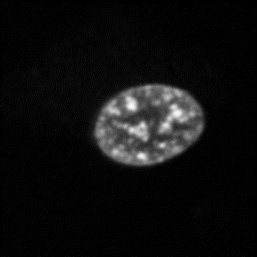
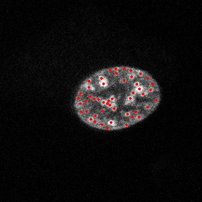
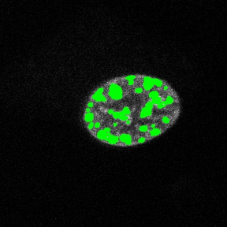
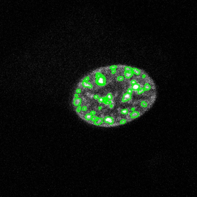
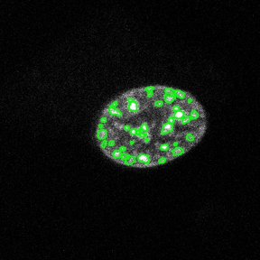
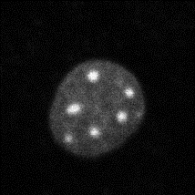
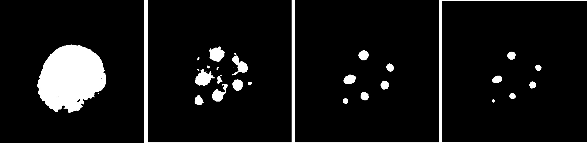

# AQUAPONCS
Algorithm to Quantify Properties of Nuclear and Chromatin Structure

## Set-up
Create a conda environment and activate it:\
`conda create -n aqua`\
`source activate aqua`

Install following packages (version number optional):\
`conda install pip`\
`pip install numpy pandas matplotlib opencv-python scikit-image`\
pip (v. 22.1.2)\
numpy (v. 1.23.3)\
pandas (v. 1.5.2)\
matplotlib (v. 3.6.0)\
opencv-python (v. 4.6.0.66)\
scikit-image (v. 0.19.3)

Clone aquaponcs repo and cd into it:\
`git clone https://github.com/KurtisWinkler/aquaponcs.git`\
`cd aquaponcs` 

Test that the code works:\
`python blob_main.py --file_name example_images/ex111.tif`

## Purpose 
Visualizing chromatin dispersal and nuclear structure can reveal information about cell stability, gene expression, and cell fate. Current image processing pipelines are largely qualitative, creating a need for an algorithm to quantify nuclear structure and detect/measure properties of chromatin blobs. AQUAPONCS utilizes openCV and scikit image packages to process input images, identify nucleus contours, identify chromatin blob contours, measure parameters of blobs, and filter/score blobs. The software outputs a processed image along with a .csv file quantifying the structure of the nucleus and chromatin.  

## Usage
### Blob detection 
The main workflow for blob detection is carried out through blob_main.py. Users must define the following arguments as described in blob_args.py: 

`--file_name` (str): the name of the input image file to be processed

`--min_distance` (int): minimum pixel distance between blob maxima. Decreasing will allow for greater granularity for detection of overlapping blobs (default: 10)

`--min_thresh_maxima` (float): minimum relative intensity threshold for maxima (default: 0.8)

`--min_thresh_contours` (float): minimum relative threshold for contours (default: 0.8)

`--thresh_step` (int): step size for finding contours (default: 5)

If the user does not wish to include initial, similar, or outlier filters, the following optional arguments can be added: 
`--no_init_filter`
`--no_sim_filter`
`--no_out_filter`

The following can be modified directly in blob_main.py:

init_filter (list): the initial filter for removing blobs. This could be used for removing blobs based on user-defined parameters (ie, too small of area, non-uniform circularity)

sim_filter (list): filters for similar blobs. Differentiates between unique blobs

out_filter (list): filters for outlier blobs whose parameters fall outside of a user-defined range 

best_filter (list): user-defined criteria to determine which parameters are used to score and identify the best blobs

### Blob Class and Parameters (blob_class.py and blob_params.py)
blob_class.py creates a class object, blob, to get attributes of all blobs. It inherits from the RegionProperties class in scikit-image. A list of properties can be found in sci-kit documentation: 
"https://scikit-image.org/docs/stable/api/skimage.measure.html#skimage.measure.regionprops"

Attributes include:
contour (nested list): contour list of blobs in scikit format
cv_contour (nested list): like contour but in openCV format (uses double brackets)
orig_image (image matrix): original image that the contour was generated from
label_im (matrix): image labeled by region and contours

Methods associated with the class can be read in blob_class.py

## Examples 
Using the input image,

we recommend the following workflow:
1. Change to gray scale

2. Blur the image

3. Identify the peak local maxima

4. Identify maxima blobs

5. Filter blobs

6. Filter similar blobs

7. Filter outlier blobs

8. Score the best blobs (based on user-defined criteria)

9. Output final image

### Thresholds
Using the input image,

different threshold values can be applied to detect different blobs. The contours of these thresholds are used to find blobs. The following examples process the above example with thresholds of 50, 80, 110, and 140:

